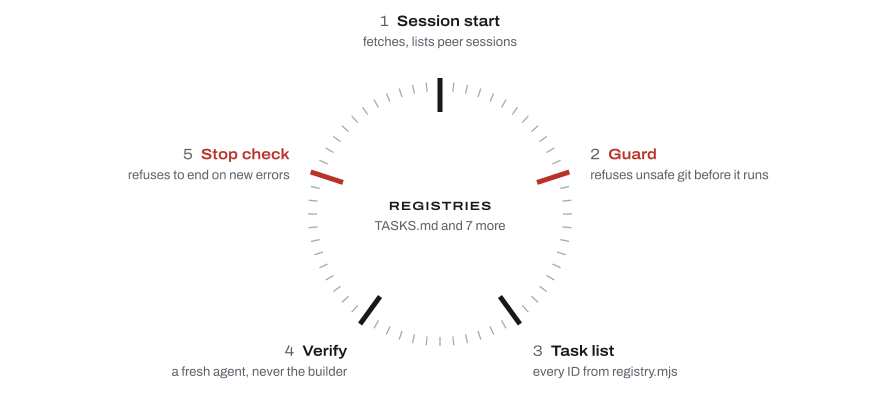

# Clockwork

Clockwork is a kit of hooks, scripts and rules for client projects built with Claude Code. The rules that must always hold run as code, so parallel sessions and overnight runs can share one project without overwriting each other's work.

<picture>
  <source media="(prefers-color-scheme: dark)" srcset="docs/assets/cycle-dark.svg">
  
</picture>

## How a session runs

1. **Session start** fetches origin, lists the other live sessions and prints a health summary.
2. **Guard** stops `git add -A`, `git stash`, skipped git hooks and force-pushes to main before they run; overnight, production deploys too.
3. **Task list**: every task gets its ID from `registry.mjs`, with the condition that closes it.
4. **Verify**: a fresh agent checks the work, never the one that built it. A task cannot be marked verified without its evidence.
5. **Stop check**: the session cannot end while it has left the records wrong.

When a session runs `git add -A`, the guard answers:

```text
Blocked: "git add -A" stages every file in the checkout, including other sessions' unfinished work. Stage exact paths instead: git add <file> <file> && git commit -m "…".
```

Each step in detail: [docs/how-it-works.md](docs/how-it-works.md).

## Install

Needs Claude Code, git and Node.js. Overnight runs need macOS.

```sh
git clone https://github.com/marykovziridze/clockwork ~/dev/clockwork
node ~/dev/clockwork/install.mjs ~/dev/my-site --stack nextjs          # prints the plan
node ~/dev/clockwork/install.mjs ~/dev/my-site --stack nextjs --apply  # writes it
```

An existing project comes in through `/clockwork-onboard`. Upgrades, flags and what lands where: [docs/install.md](docs/install.md).

## Other agents

The rules live in `AGENTS.md`, which Codex, Cursor, GitHub Copilot and other agents read, and `registry.mjs` is plain Node. The guard and the stop check are Claude Code hooks, so only Claude Code enforces the rules. Not tested with other agents.

## Not proven yet

A real overnight run, a real `claude -w` session writing tasks, and the multi-agent workflows on a real model; their tests use mocks. Details: [docs/status.md](docs/status.md).

## Tests

In the kit folder, `node --test --test-timeout=180000 test/` runs every test offline.

## More

[Benchmarks](docs/benchmarks.md) · [Why it is built this way](WHY.md) · [Sharing a copy safely](docs/sharing.md) · [Changelog](CHANGELOG.md)

## License

MIT. Provided as is, without support; issues and pull requests are switched off.
